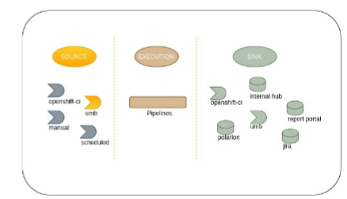
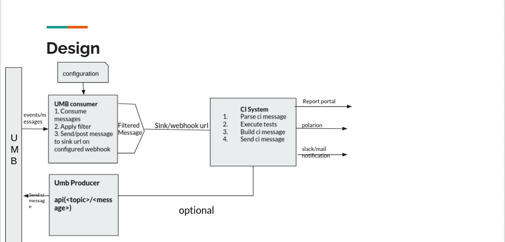

# UMB external system triggering gating service

## context


## Design overview
UMB integration with qe platform



## Run locally

* To run locally use podman/docker to build image
```
docker build -t <image-name> .

```
* umb brokers deployed behind the vpn to test this up use network `host` instead
```
docker run -it --network=host <image-name> /bin/bash

(app-root) python app.py  <-c optional config path >

```
## Producer service
* You can find implementation code under `producer` section
* As of now we expose `produce` service as an api(with edge termination `https`)
    1. will help user to produce messages to required topic. (`POST`)

* Now you can deploy this services on any openshift cluster deployed behind the vpn! (psi)

* Now user should be able to post json or text message to any topic

```
 > curl -X POST -H 'Content-Type: application/json' <umb-service-route-url>/produce -d '{"topic": "topic://VirtualTopic.qe.ci.product-scenario.test.complete", "message": {}}'               
```

*Response:* 

```
{
    "Message": "message sent successfully! to topic topic://VirtualTopic.qe.ci.product-scenario.test.complete"
}

```

### Pre-requistes
- setup configmaps & secrets prior
```
oc apply -f configs/configmap.yaml

oc apply -f configs/secrets.yaml

```

### Consumer service

```
oc apply -f consumer/openshift/imagestream.yaml

oc apply -f consumer/openshift/build-config.yaml

oc apply -f consumer/openshift/deployment-config.yaml

oc rollout status dc/umb-consumer

```

### Producer service

```
oc apply -f producer/openshift/imagestream.yaml

oc apply -f producer/openshift/build-config.yaml

oc apply -f producer/openshift/deployment-config.yaml

oc rollout status dc/umb-producer

oc apply -f producer/openshift/service.yaml

oc get route umb-service --template='http://{{.spec.host}}'

```

## UMB notifications
You can easily produce a message to UMB topic to notify if your pipeline has failed or run sucessfully. There is a script in `misc/send-umb-interop-notifier.py` or `misc/send-umb-iib-notifier.py` that can help you with that, with the help of the finally tasks in your pipeline.

At the end of your pipeline add this block :
```
  finally:
  - name: finally
    workspaces:
    - name: kubeconfig
      workspace: kubeconfig
    params:
    - name: artifacts
      value: $(tasks.echo-artifacts.results.artifacts)
    taskSpec:
      workspaces:
      - name: kubeconfig
      params:
      - name: artifacts
        description: artifatcs of previous taskruns
      steps:
        - name: send-umb-notification
          env:
            - name: UMB_WEBHOOK_URL
              value: "http://umb-service-umb.apps.cicd.tekton.codereadyqe.com/produce"
            - name: PIPELINERUN
              valueFrom:
                fieldRef:
                  fieldPath: metadata.labels['tekton.dev/pipelineRun']
            - name: NAMESPACE
                      valueFrom:
                        fieldRef:
                          fieldPath: metadata.namespace      
            - name: LOG_URL
              value: "openshift"
            - name: VERSION
              value: $(tt.params.layered_product_version)
            - name: XUNIT_URLS
              value: $(params.artifacts)
            - name: KUBECONFIG
              value: $(workspaces.kubeconfig.path)/kubeconfig  
          image: quay.io/praveen4g0/umb-notifier:latest
          command: ["/code/send-umb-interop-notifier.py"]
          # command: ["/code/send-umb-iib-notifier.py"]
```

## How to use?

* Here is, sample [resources](demo/dummy-resources) to guide you, how to setup pipelines by consuming umb services.

* Apply trigger resources
```
oc apply -f https://raw.githubusercontent.com/praveen4g0/umb/v0.0.1/demo/dummy-resources/eventlistener.yaml

oc apply -f https://raw.githubusercontent.com/praveen4g0/umb/v0.0.1/demo/dummy-resources/triggerbinding.yaml

oc apply -f https://raw.githubusercontent.com/praveen4g0/umb/v0.0.1/demo/dummy-resources/triggertemplate.yaml

oc expose svc el-demo-interop-listener

sink_url=$(oc get route el-demo-interop-listener  --template='http://{{.spec.host}}')
```

* now `$sink_url` will be your sink url to configure in consumer service to receive configured messages from umb topic
see sample configration [here](configs/configmap.yaml) to receive notifications from umb consumer service.