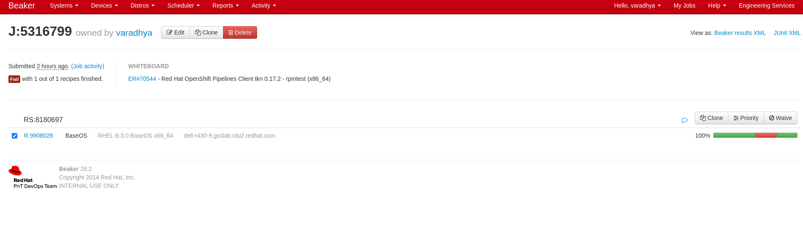
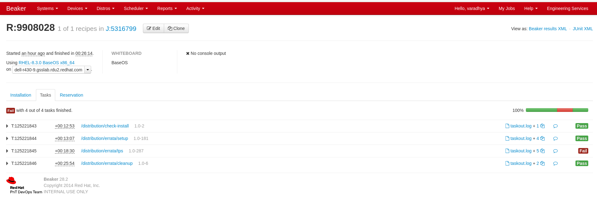
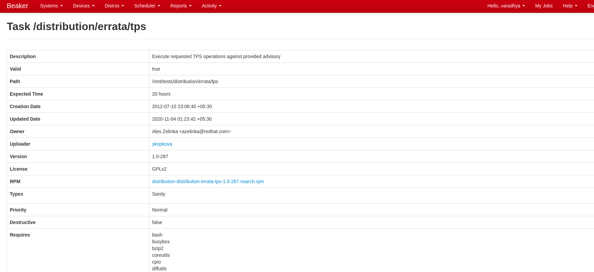

TPS tests
============================

TPS Definition
-------------
TPS stands for Test Package Sanity.

TPS consists of scripts that run basic sanity tests and DistQA (formerly known as RHNQA) tests. These tests are supposed to check whether it is possible to update a given set of errata packages (or install them if they are new in the distribution) and rebuild their source RPM. Note that plain `rpm` and `rpmbuild` commands is used to run the tests. TPS expects dependencies to be already installed.

Later in the errata workflow, when QE has pushed the erratum to Stage, TPS also tests whether it is possible to update (or install) the packages from Stage using yum.
[More Info](http://wiki.test.redhat.com/ReferenceManual/Tps)

Resources & Tools
-----------------
1. [Errata Tool](https://errata.devel.redhat.com/)
2. [TPS Wiki](http://wiki.test.redhat.com/Faq/Tps)
3. [Beaker](https://beaker.engineering.redhat.com/)
4. [Beaker Client](https://docs.engineering.redhat.com/display/HTD/beaker.engineering.redhat.com+User+Guide)
5. [QA Tools](http://wiki.test.redhat.com/BaseOs/Projects/QaTools)
6. [workflow-tomorrow](http://wiki.test.redhat.com/BaseOs/Projects/WorkflowTomorrow)
7. [tps-results](http://wiki.test.redhat.com/tcerna/tps-results)
8. [kerberos login](https://gitlab.cee.redhat.com/openshiftdo/release/-/tree/master#step-1-configuring-your-kerberos-login)

OATS Test Profile
-----------------
Test Profiles are the mechanism that **OATS (Onboot Activate Test System)** uses to determine and apply the correct RHN configurations for a test system. Profiles are kept on Tps-server, and specify a collection of base and child channels for the Stream which the test system runs.

[More Info](http://tps-server.lab.bos.redhat.com/wiki/TestProfiles) on Creating/Editing test profiles

[More Info](http://wiki.test.redhat.com/ReferenceManual/Oats) on **OATS**

Triggering TPS jobs
-------------------
When errata’s TPS job is not started and its status is in a `NOT_STARTED` , it is likely that there are no stable systems available to run those test for whatever reason. In that case, there is a way to run those tests via a Beaker job and then upload the results into the errata when it’s done. You need to do [kerberos login](https://gitlab.cee.redhat.com/openshiftdo/release/-/tree/master#step-1-configuring-your-kerberos-login) before triggering the TPS tests 
* Trigger a TPS job for the errata #EID
    
    `$ bkr workflow-tomorrow --errata=$EID --tps-rpmtest --tps-srpmtest --profile=$test-profile-name`

    you can use the `--arch` flag to specify the architecture on which you want to run the tests
    
    Sample output:
    ```
    $ bkr workflow-tomorrow --errata=70544 --tps-rhnqa --profile=stable-pipelines-for-rhel-8 --arch=x86_64
    Inspecting erratum ER#70544 - Red Hat OpenShift Pipelines Client tkn 0.17.2
    Using distro rhel-8 from the Errata Tool
    Distro rhel-8 scheduled with RELEASED tag
    Found 0 singlehost task, 1 recipe set created
    Successfully submitted as TJ#5316747
    ```
    A beaker job will get created and you can access the job using the URL A job in Beaker is created with a unique ID (#JID): https://beaker.engineering.redhat.com/jobs/${#JID}. In the above example the job ID is **5316747**
* Uploading TPS Results to Errata

    After the job is finished, run the following command to upload the results to the respective errata (#EID)

    `$ tps-results --errata $EID --job $JID`
* Running `TPS RHNQA` tests

    Once the build is moved to `stage` we need to run `TPS RHNQA` tests 

    `$ bkr workflow-tomorrow --errata=$EID --tps-rhnqa --profile=$test-profile-name --arch=x86_64`

Download the Source code of task in Beaker
------------------------------------------
1. To know the source code of the job in the beaker, open the beaker job in web browser and click on the recipe id (`R:9908028` in the below image) 
2. Click on the task for which you want to download the souce code 
3. Click on the link which is associated with the row `RPM` and the rpm file will get downloaded 
4. Extract the downloaded rpm

Connecting to Beaker machine
----------------------------
If you want to debug a TPS failure on a stable system (where TPS tests ran), you need to connect to machine via ssh as a `root` user and the commonly used password can be found [here](http://wiki.test.redhat.com/ReferenceManual/StableSystems#Connecting) and [here](https://beaker.engineering.redhat.com/prefs/). The `hostname` of the machine can be found in the beaker job itself. In the image below the hostname of the machine is `dell-r430-9.gsslab.rdu2.redhat.com`


Run TPS manually
----------------
If there are limited test machines ([check here](http://liver3.lab.eng.brq.redhat.com:3000/d/ZLIha3sGz/beakerstatus?orgId=1&refresh=5s&from=now-1h&to=now)) available for any arch, the scheduled TPS beaker job will go to `Queue` state and if there is lack of time and you cannot wait for the beaker job to get completed. In those cases you can run TPS tests maually.

Steps to run TPS manually can be found [here](http://wiki.test.redhat.com/Faq/Tps/RunningTpsManually)

**Note:** 
1. For Openshift Pipelines CLI, substeps 3,4 and 5 of step 7 in [Erratify](http://wiki.test.redhat.com/Faq/Tps/RunningTpsManually) section is not required
2. Stable system (System where TPS tests are run) can be created in beaker using the command 
`bkr workflow-tomorrow --arch $required-arch --stable-system --profile $test-profile-name` and can be connected to the system using the steps given in the section `Connecting to Beaker machine` and TPS tests can be run using the steps given in section `Run TPS manually`
